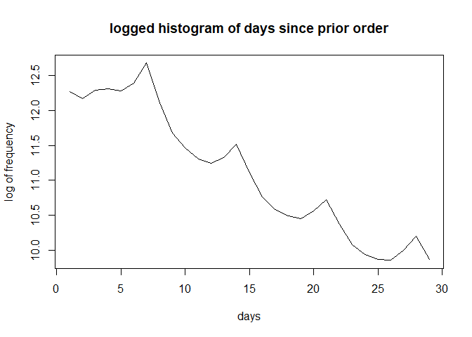
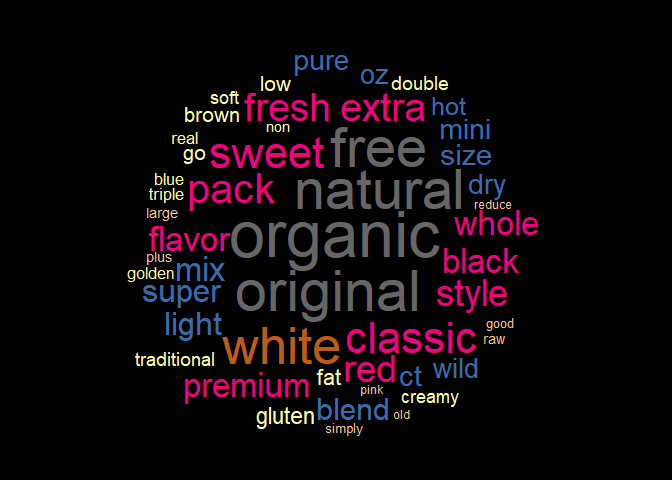
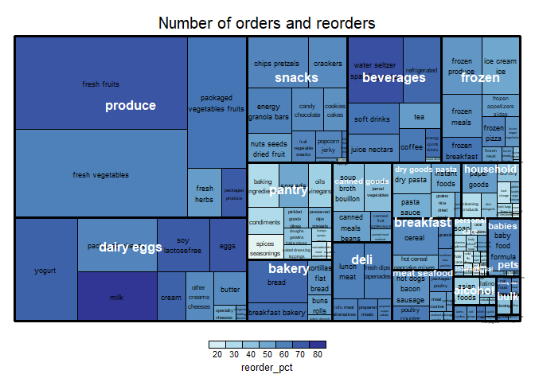
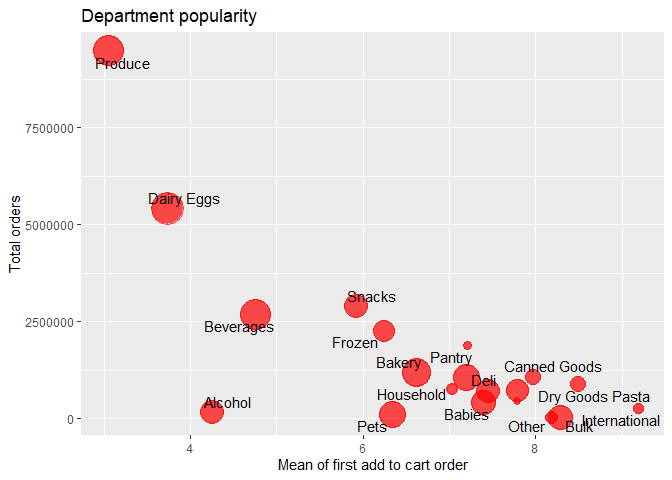
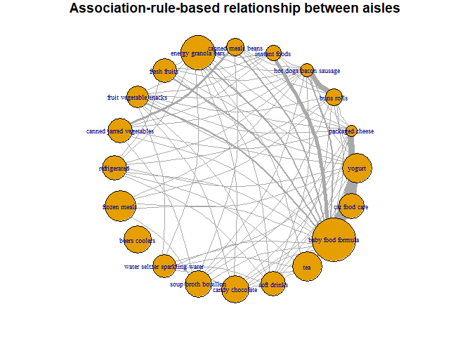

Instacart Analysis
================
Jerry Chiu
February 7, 2021

## Instacart Analysis

Instacart is an online grocery store with around 50000 items. The main objective of this project is the mining of relevant association rules for use in hypothetical online recommenders. This is not just a simple mining of all association rules; this project will take into account the flexibility, the usefullness, and the importance of the association rules mined to provide new perspectives in designing recommenders. For the in-depth report, please go to [the project final report](https://github.com/jerchiury/InstacartProject/blob/master/instacart.md). 

Below is some brief results:

There is some periodicity for user's orders, peaks are at 7, 14, 21 and 28 days.

Some of the most common product descriptors:

The most ordered and reordered products:

The product basket placement:

Some interesting cross-aisle rules found, the names are the cluster names, descriptive of the product cluster, not the real product names:
    ##                                           LHS.name                RHS.name
    ## 49       marinara sauce spicy, ricotta cheese skim     lasagna wheat pasta
    ## 43  marshmallow vanilla puff, cracker graham honey      chocolate bar milk
    ## 57         pizza sauce authentic, part skim cheese  pepperoni slice turkey
    ## 12                          frost vanilla funfetti    cake chocolate moist
    ## 380        popcorn gourmet peanut, nut pine hummus         chip pita naked
    ## 58                                 gin spin london tonic water elderflower
    ##          lift
    ## 49   90.96881
    ## 43   95.83803
    ## 57   86.97493
    ## 12  231.04207
    ## 380  17.61800
    ## 58   86.21966

Looks like we got some lasagna, s'mores, pizza, vanilla chocolate cake, movie snacks with popcorn and chips, and gin and tonic. Those are just a few of the variety we have in the cross-aisle rules.

Some connections with association rules ound between popular aisles:

For all the association rules, go to arules_all_s03_c015.csv
For all the cross-aisle association rules, go to arules_cross_s03_c015.csv