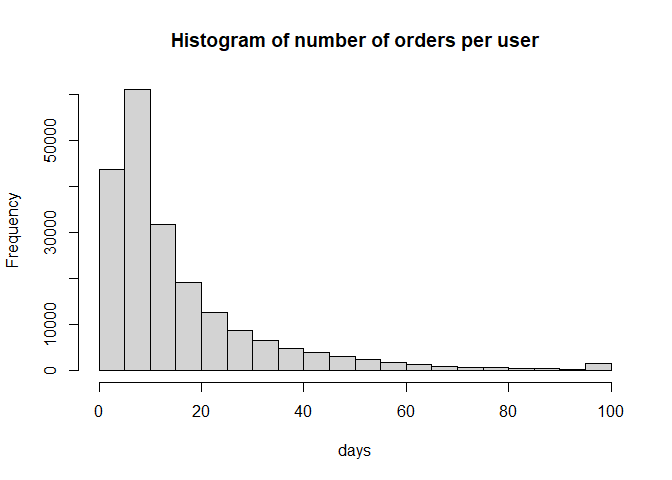
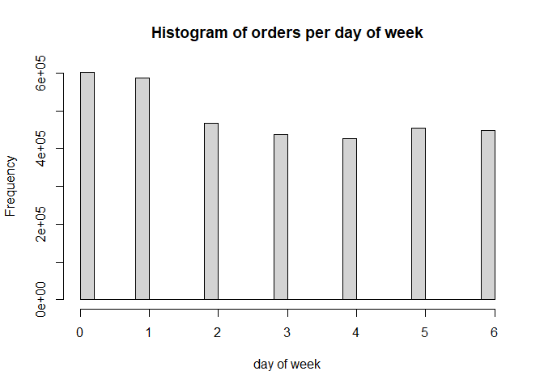
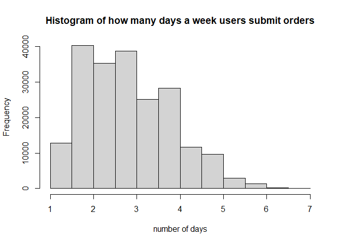
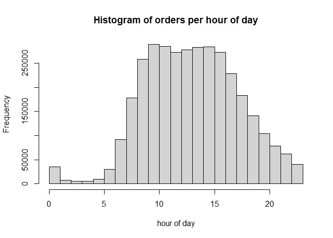
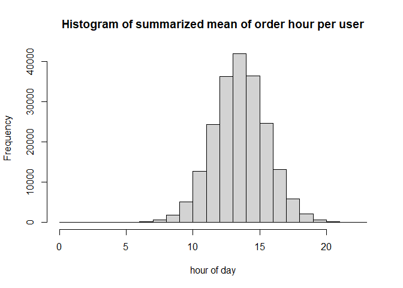
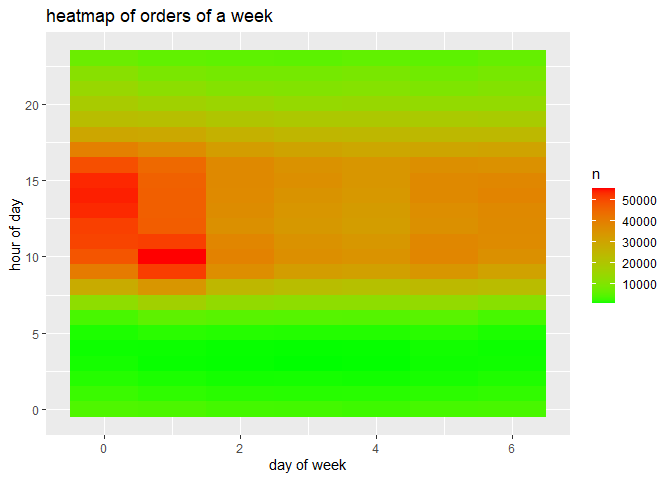
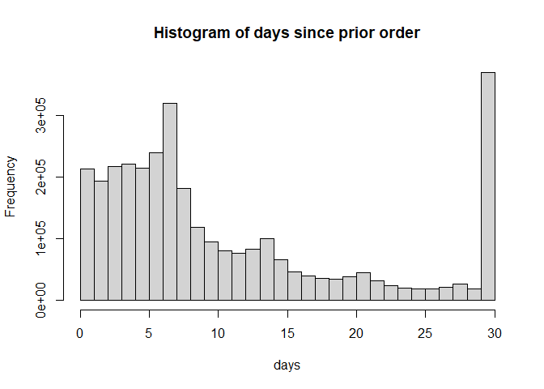
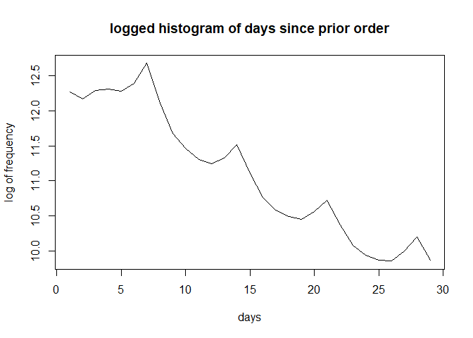
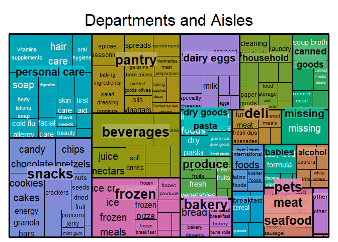
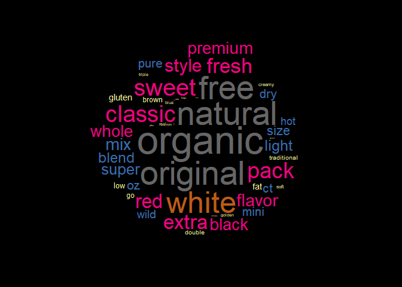

Instacart Analysis
================
Jerry Chiu
February 7, 2021

## Abstract

The main objective of this project is the mining of relevant association rules for use in hypothetical online recommenders. This is not just a simple mining of all association rules; this project will take into account the flexibility, the usefullness, and the importance of the association rules mined to provide new perspectives in designing recommenders.

The analysis takes the following steps:

1.  Data understanding and data integrity check
2.  Data cleaning, data exploration, and statistical analysis
3.  Feature Engineering
4.  Clustering of products
5.  Mining of association rules
6.  Exploration of the association rules
7.  Summary

## 1. Data Understanding and integrity check

The data comes from [Instacart](https://tech.instacart.com/3-million-instacart-orders-open-sourced-d40d29ead6f2), an online shopping platform. The datasets used in this project are:

-   aisles.csv
-   departments.csv
-   products.csv
-   orders.csv
-   order\_products\_\_prior.csv

``` r
aisles=read.csv('aisles.csv')
departments=read.csv('departments.csv')
products=read.csv('products.csv')
orders=read.csv('orders.csv')
order_pp=read.csv('order_products__prior.csv')

# see if any cell is just white space
white.space=function(data){
  return(sum(grepl('^[ ]*$',data)))}

# aisles.csv
colSums(is.na(aisles))
```

    ## aisle_id    aisle 
    ##        0        0

``` r
sapply(aisles, white.space)
```

    ## aisle_id    aisle 
    ##        0        0

``` r
# departments
colSums(is.na(departments))
```

    ## department_id    department 
    ##             0             0

``` r
sapply(departments, white.space)
```

    ## department_id    department 
    ##             0             0

``` r
# orders
colSums(is.na(orders)) #206209, all from days_since_prior_order
```

    ##               order_id                user_id               eval_set           order_number              order_dow 
    ##                      0                      0                      0                      0                      0 
    ##      order_hour_of_day days_since_prior_order 
    ##                      0                 206209

``` r
sapply(orders, white.space)
```

    ##               order_id                user_id               eval_set           order_number              order_dow 
    ##                      0                      0                      0                      0                      0 
    ##      order_hour_of_day days_since_prior_order 
    ##                      0                      0

``` r
# products
colSums(is.na(products))
```

    ##    product_id  product_name      aisle_id department_id 
    ##             0             0             0             0

``` r
sapply(products, white.space)
```

    ##    product_id  product_name      aisle_id department_id 
    ##             0             0             0             0

``` r
# order_pp
colSums(is.na(products))
```

    ##    product_id  product_name      aisle_id department_id 
    ##             0             0             0             0

we see that there are no white space or NA's except for the 206209 NA's in orders.csv, let's see why.

``` r
head(orders[which(is.na(orders$days_since_prior_order)),])
```

    ##    order_id user_id eval_set order_number order_dow order_hour_of_day days_since_prior_order
    ## 1   2539329       1    prior            1         2                 8                     NA
    ## 12  2168274       2    prior            1         2                11                     NA
    ## 27  1374495       3    prior            1         1                14                     NA
    ## 40  3343014       4    prior            1         6                11                     NA
    ## 46  2717275       5    prior            1         3                12                     NA
    ## 51  2086598       6    prior            1         5                18                     NA

we see that the order\_id is quite random, but the user\_id goes up and is in order, and order\_number is always 1. let's guess that the relationship is that days\_since\_prior\_order is NA exactly when order\_number is 1

``` r
nrow(filter(orders, is.na(days_since_prior_order), order_number!=1))
```

    ## [1] 0

we get nothing such that order number is not 1 and days\_since\_prior\_order is NA, confirming the conjecture

Now the data integrity is checked, we can go onto understand and explore it.

products=read.csv('products\_clean.csv') products.clust=read.csv('products\_clust.csv') clusters=read.csv('cluster.csv') aisle.dep=read.csv('aisle\_dep.csv') order\_size=read.csv('order\_size.csv')

# aisles.csv

``` r
str(aisles)
```

    ## 'data.frame':    134 obs. of  2 variables:
    ##  $ aisle_id: int  1 2 3 4 5 6 7 8 9 10 ...
    ##  $ aisle   : chr  "prepared soups salads" "specialty cheeses" "energy granola bars" "instant foods" ...

``` r
head(aisles)
```

    ##   aisle_id                      aisle
    ## 1        1      prepared soups salads
    ## 2        2          specialty cheeses
    ## 3        3        energy granola bars
    ## 4        4              instant foods
    ## 5        5 marinades meat preparation
    ## 6        6                      other

aisles.csv contains the aisle ID and aisle name that the products are sorted into. Total of 134 aisles. Aisle 6 looks peculiar as it is labeled "other", and aisles 100 is named "missing". Otherwise, nothing interesting yet.

# departments.csv

``` r
str(departments)
```

    ## 'data.frame':    21 obs. of  2 variables:
    ##  $ department_id: int  1 2 3 4 5 6 7 8 9 10 ...
    ##  $ department   : chr  "frozen" "other" "bakery" "produce" ...

``` r
head(departments)
```

    ##   department_id    department
    ## 1             1        frozen
    ## 2             2         other
    ## 3             3        bakery
    ## 4             4       produce
    ## 5             5       alcohol
    ## 6             6 international

departments.csv contains the department ID and department name that the products are sorted into. Total of 21 departments. Department 2 looks peculiar as it is labeled "other", and department 21 is named "missing". Otherwise, nothing interesting yet.

# orders

``` r
str(orders) 
```

    ## 'data.frame':    3421083 obs. of  7 variables:
    ##  $ order_id              : int  2539329 2398795 473747 2254736 431534 3367565 550135 3108588 2295261 2550362 ...
    ##  $ user_id               : int  1 1 1 1 1 1 1 1 1 1 ...
    ##  $ eval_set              : chr  "prior" "prior" "prior" "prior" ...
    ##  $ order_number          : int  1 2 3 4 5 6 7 8 9 10 ...
    ##  $ order_dow             : int  2 3 3 4 4 2 1 1 1 4 ...
    ##  $ order_hour_of_day     : int  8 7 12 7 15 7 9 14 16 8 ...
    ##  $ days_since_prior_order: num  NA 15 21 29 28 19 20 14 0 30 ...

orders.csv contains the order inormation of each user. It contains the user id off each customer, the order id or each order, the day and hour the order is placed, the order number of each user (chronologically), and the gep between two off the user's consecutive orders (days since prior order). Let's look at some stats starting with the number of orders each user has placed.

``` r
test=orders%>%group_by(user_id)%>%summarise(max=max(order_number))
summary(test$max)
```

    ##    Min. 1st Qu.  Median    Mean 3rd Qu.    Max. 
    ##    4.00    6.00   10.00   16.59   20.00  100.00

``` r
hist(test$max, main='Histogram of number of orders per user', xlab='days')
```



Looks like a small outlier of supershoppers with 100 orders... next, we examine the days of the week the orders are placed.

``` r
hist(orders$order_dow, main='Histogram of orders per day of week', xlab='day of week')
```



Looks like day of week 0 and 1 are the most popular. Does the avg user order on a particular dow?

``` r
test1=orders%>%group_by(user_id, order_dow)%>%summarise(n=n())
test=test1%>%group_by(user_id)%>%summarize(max=1/max(n/sum(n)))
summary(test$max)
```

    ##    Min. 1st Qu.  Median    Mean 3rd Qu.    Max. 
    ##   1.000   2.000   2.800   2.923   3.609   7.000

``` r
hist(test$max, main='Histogram of how many days a week users submit orders', xlab='number of days')
```



The result is such that the avg user shops about 3 main days of the week, reasonably spread. Now let's look at the hour of order, same processes.

``` r
summary(orders$order_hour_of_day) # 0 to 23
```

    ##    Min. 1st Qu.  Median    Mean 3rd Qu.    Max. 
    ##    0.00   10.00   13.00   13.45   16.00   23.00

``` r
hist(orders$order_hour_of_day, main='Histogram of orders per hour of day', xlab='hour of day')
```



The peak shopping time is about 10 to 15 o'clock. Do ppl have a tendency to order at certain time of day?

``` r
test=orders%>%group_by(user_id)%>%summarise(mean=mean(order_hour_of_day), sd=sd(order_hour_of_day))
summary(test$mean) #mean of 13.59. about 1 oclock
```

    ##    Min. 1st Qu.  Median    Mean 3rd Qu.    Max. 
    ##    0.75   12.25   13.57   13.59   14.90   23.00

``` r
hist(test$mean, main='Histogram of summarized mean of order hour per user', xlab='hour of day')
```



The average standard deviation is 3.5 hours, meaning on average, the users usually orders within 3.5 hours of their previous orders, somewhat consistent. Now the heatmap.

``` r
orders.heat=orders%>%group_by(order_dow, order_hour_of_day)%>%summarise(n=n())

ggplot(data=orders.heat)+
  geom_tile(aes(x=order_dow,y=order_hour_of_day, fill=n))+
  scale_fill_gradient(high='red', low='green')+
  labs(title="heatmap of orders of a week", x='day of week', y='hour of day')
```



Let's see about day since prior order.

``` r
summary(orders$days_since_prior_order, na.rm=T) 
```

    ##    Min. 1st Qu.  Median    Mean 3rd Qu.    Max.    NA's 
    ##    0.00    4.00    7.00   11.11   15.00   30.00  206209

``` r
hist(orders$days_since_prior_order, main='Histogram of days since prior order', xlab='days')
```



``` r
median(filter(orders, days_since_prior_order!=30)$days_since_prior_order, na.rm=T)
```

    ## [1] 7

Looks like there is a spike at 30 days, this is the cap of the data. The median is 7 days since prior order. Do ppl have a tendency to order in certain day intervals? I think a log graph of the frequency of the histogram would help.

``` r
no30=filter(orders, days_since_prior_order!=30 & !is.na(days_since_prior_order)) #removing 30 days since it is a hard cap
test=hist(no30$days_since_prior_order, plot=F)
plot(x=1:29, y=log(test$counts), type='line', main='logged histogram of days since prior order', xlab='days', ylab='log of frequency')
```



Looks quite nice with the peaks at multiples of 7, and the decay after is quite predictable In orders, we learned that users usually have 2 to 3 days of the week that they place orders on, and the time of day they do so is within 3.5 hours of each other. We also learned that there is clear signs of weekly ordering (orders of 7, 14, 21, 28 days apart).

# products

``` r
str(products)
```

    ## 'data.frame':    49688 obs. of  4 variables:
    ##  $ product_id   : int  1 2 3 4 5 6 7 8 9 10 ...
    ##  $ product_name : chr  "Chocolate Sandwich Cookies" "All-Seasons Salt" "Robust Golden Unsweetened Oolong Tea" "Smart Ones Classic Favorites Mini Rigatoni With Vodka Cream Sauce" ...
    ##  $ aisle_id     : int  61 104 94 38 5 11 98 116 120 115 ...
    ##  $ department_id: int  19 13 7 1 13 11 7 1 16 7 ...

products.csv contains the product id, name, the aisle the product belongs to, and the department. The first interest here is the relationship between aisle and department. Each aisle belongs to only 1 department. Let's see the relationship. aisle.dep=unique(products\[c('aisle\_id','department\_id')\])

``` r
test=products%>%group_by(department_id, aisle_id)%>%summarise(n=n())
test$department_id=departments[test$department_id,'department']
test$aisle_id=aisles[test$aisle_id,'aisle']
treemap(test, index=c('department_id', 'aisle_id'), vSize='n', title='Departments and Aisles', overlap.labels = 1, fontsize.title = 24, fontsize.labels=c(20,15), ymod.labels=c(0.3,0))
```



Now, let's see about the product names, cleaning it, to prepare it for clustering. We do this by comparing the most common adjectives shared among the different aisles.

``` r
unique.words=function(data){
  temp=data$product_name
  temp=Boost_tokenizer(temp)
  temp=unique(temp)
  
  return(data.frame(temp))}

mystop=stopwords::stopwords(language='en')
products=inner_join(products, aisles)
```

    ## Joining, by = "aisle_id"

``` r
products=inner_join(products, departments)
```

    ## Joining, by = "department_id"

``` r
product.names=products
product.names$product_name=gsub('[^A-z]', ' ', product.names$product_name)
product.names$product_name=removePunctuation(product.names$product_name)
product.names$product_name=lemmatize_strings(product.names$product_name)
product.names$product_name=gsub('[^A-z]', ' ', product.names$product_name)
product.names$product_name=gsub(" *\\b[[:alpha:]]{1}\\b *", " ", product.names$product_name)
product.names$product_name=trimws(product.names$product_name)
product.names$product_name=gsub(' +',' ',product.names$product_name)
product.names$product_name=tolower(product.names$product_name)
product.names$product_name=removeWords(product.names$product_name, mystop)
aisle.product.names=product.names%>%group_by(aisle)%>%group_modify(~unique.words(.x))
# now we have all the unique words of every aisle, we can tally
aisle.token.table=table(aisle.product.names$temp)
aisle.token.table=aisle.token.table/max(aisle.token.table)
aisle.token.table=aisle.token.table[order(aisle.token.table, decreasing=T)]
#we only want to filter out the non-nouns
# we use NLP tagging to find all the non-nouns in the descriptor 
top=data.frame(word=tolower(names(aisle.token.table)), freq=as.vector(aisle.token.table))

annotate.word=function(word){
  temp=annotate(word, list(Maxent_Sent_Token_Annotator(), Maxent_Word_Token_Annotator()))
  temp=annotate(word, Maxent_POS_Tag_Annotator(), temp)
  temp=subset(temp, type=='word')
  tags=sapply(temp$features, '[[', 'POS')
  return(tags)
}

tags=annotate.word(top$word)
top=cbind(top, tags)
top=top[order(top$freq, decreasing=T),]
# since the NLP tags are not perfect (orange got tagged as adj but we do have some oranges in produce), we manually filter

top[which(top$word%in%c('pack', 'style', 'flavor', 'mix','light','blend','size','ct','mini','oz')),'tags']='JJ'
top[which(top$word%in%c('orange','almond','french','olive')),'tags']='NN'

topJJ=subset(top, !tags%in%c('NN','DT','TO'))
topJJ=topJJ[1:50,]

aisle.token.table=subset(aisle.token.table, names(aisle.token.table)%in%topJJ$word)
par(bg="black")
wordcloud(words=topJJ$word, freq=topJJ$freq, scale=c(4,-2), rot.per=F, random.order=F, use.r.layout=T, colors=brewer.pal(8,"Accent"), random.color=F) #top words
```



we see that free, natural, organic, original are the our biggest common words between all the aisles. We can filter them out along with some others when we get to the analysis part.

count.ngrams=function(data, n, nword='all'){ temp=data$product\_name temp=removeWords(temp, top10) temp=gsub(" *\\b\[\[:alpha:\]\]{1}\\b *", " ", temp) temp=trimws(temp) temp=gsub(' +', ' ',temp) temp=temp\[which(sapply(strsplit(temp, " "), length)&gt;=n)\] temp=ngram(temp, n=n) temp=get.phrasetable(temp) if(is.numeric(nword)){ temp=temp\[1:nword,\]} return(temp)}

ngram.treemap=function(data, n, nword){ ngram.dep=data%&gt;%group\_by(department\_id)%&gt;%group\_modify(~count.ngrams(.x, n=n, nword=nword)) ngram.dep*d**e**p**a**r**t**m**e**n**t*<sub>*i*</sub>*d* = *s**t**r*<sub>*t*</sub>*o*<sub>*t*</sub>*i**t**l**e*(*d**e**p**a**r**t**m**e**n**t**s*\[*n**g**r**a**m*.*d**e**p*department\_id,'department'\]) ngram.dep$size=1 png(filename=paste0("dep\_", n, "gram\_treemap.png"),width=1920, height=1080) treemap(ngram.dep, index=c('department\_id', 'ngrams'), algorithm='pivotSize', vSize='size', title=paste0('Top ', nword,' Frequent ', n, '-grams of each Department'), overlap.labels = 1, fontsize.title = 20, fontsize.labels=c(25,18), bg.labels=0, fontcolor.labels=c('white','black'), force.print.labels=T, ymod.labels=c(0.3,0)) dev.off() }

for(i in c(1,2,3,4)){ngram.treemap(product.names, i, 10)} \# variance of product per aisle based on product name only, the higher the variance, the lower the name diversity prod.var=product.names%&gt;%group\_by(department\_id, aisle\_id)%&gt;%group\_modify(~count.ngrams(.x, n=1)) prod.var=prod.var%&gt;%group\_by(department\_id, aisle\_id)%&gt;%summarise(var=1/(var(prop)+0.00000001)) prod.var*d**e**p**a**r**t**m**e**n**t*<sub>*i*</sub>*d* = *s**t**r*<sub>*t*</sub>*o*<sub>*t*</sub>*i**t**l**e*(*d**e**p**a**r**t**m**e**n**t**s*\[*p**r**o**d*.*v**a**r*department\_id,'department'\]) prod.var*a**i**s**l**e*<sub>*i*</sub>*d* = *a**i**s**l**e**s*\[*p**r**o**d*.*v**a**r*aisle\_id,'aisle'\]

png(filename="aisle\_name\_var.png",width=1920, height=1080) treemap(prod.var, index=c('department\_id', 'aisle\_id'), algorithm='pivotSize', vSize='var', title="Variance of 1-gram of aisles", overlap.labels = 1, fontsize.title = 20, fontsize.labels=c(25,18), bg.labels=0, fontcolor.labels=c('white','black'), force.print.labels=T, ymod.labels=c(0.3,0)) dev.off()

# huge variation in the missing and other dep and aisle.

# putting missing dep and aisle into real dep and aisle

# if we know aisle, we know its department already, so really, gotta put them into correct aisle

# we first construct a table of all 1, 2 and 3-grams of each aisle

product.names*p**r**o**d**u**c**t*<sub>*n*</sub>*a**m**e* = *r**e**m**o**v**e**W**o**r**d**s*(*p**r**o**d**u**c**t*.*n**a**m**e**s*product\_name, topJJ*w**o**r**d*)*p**r**o**d**u**c**t*.*n**a**m**e**s*product\_name=gsub(" *\\b\[\[:alpha:\]\]{1}\\b *", " ", product.names*p**r**o**d**u**c**t*<sub>*n*</sub>*a**m**e*)*p**r**o**d**u**c**t*.*n**a**m**e**s*product\_name=trimws(product.names*p**r**o**d**u**c**t*<sub>*n*</sub>*a**m**e*)*p**r**o**d**u**c**t*.*n**a**m**e**s*product\_name=gsub(' +', ' ',product.names$product\_name)

get.aisle.phrases=function(data){ phrase=data.frame() for(n in 1:3){ temp=data$product\_name  temp=temp\[which(sapply(strsplit(temp, " "), length)&gt;=n)\]  temp=ngram(temp, n=n)  temp=get.phrasetable(temp)  temp$ngrams=trimws(temp*n**g**r**a**m**s*)*t**e**m**p*phrase.length=n phrase=rbind(phrase, temp)}

return(phrase)}

predict.aisle=function(data){ pname=data$product\_name  nword=sapply(strsplit(pname, " "), length)  if(nword){}  match.found=F  while(!match.found & nword&gt;0){  temp=ngram(pname, n=nword)  temp=get.ngrams(temp)  candidates=aisle.phrases\[which(aisle.phrases$phrase.length==nword),\] candidates=filter(candidates, ngrams%in%temp) match.found=ifelse(nrow(candidates)==0, F, T) if(match.found){ pred=candidates%&gt;%group\_by(aisle\_id)%&gt;%summarise(score=sum(freq)) pred=pred\[order(pred$score, decreasing=T)\[1\],'aisle\_id'\] }else{ nword=nword-1} } if(!exists('pred')){return(100)}else{return(pred)} }

aisle.phrases=filter(product.names, aisle!='missing')%&gt;%group\_by(aisle\_id)%&gt;%group\_modify(~get.aisle.phrases(.x))

missing.aisle=filter(product.names, aisle=='missing')

test=product.names\[sample(nrow(product.names),size=3000),\]

for(i in 1:nrow(test)){ test\[i,'pred'\]=predict.aisle(test\[i,\]) print(i) }

length(which(test*p**r**e**d* = =*t**e**s**t*aisle\_id))/3000 \#91% accuracy

for(i in 1:nrow(missing.aisle)){ missing.aisle\[i,'aisle\_id'\]=predict.aisle(missing.aisle\[i,\]) print(i) }

aisle.dep=unique(products\[c('aisle\_id','aisle','department\_id','department')\]) aisle.dep=aisle.dep\[order(aisle.dep$aisle\_id),\] missing.aisle\[c('aisle','department\_id','department')\]= aisle.dep\[missing.aisle$aisle\_id, c('aisle','department\_id','department')\] test=product.names product.names\[which(product.names$aisle=='missing'),\]=missing.aisle

write.csv(product.names, 'products\_clean.csv', row.names=F)

# ------------------------------------ orders\_pp ----------------------------------------

str(order\_pp) \#all ints, a summary makes no sense since they are all mostly categorical integers \#---------------- order\_id, the sensible thing here is to see the stats of order size order\_size=order\_pp%&gt;%group\_by(order\_id)%&gt;%summarise(n=max(add\_to\_cart\_order)) summary(order\_size) \# median 8, mean 10.09 sd(order\_size) \# 7.525, which is a lot

outlier.range=function(data, mult=1.5){ low=quantile(data, 0.25, na.rm=T) high=quantile(data, 0.75, na.rm=T) iqr=IQR(data, na.rm=T) temp=c(low-mult*iqr, high+mult*iqr) return(as.vector(temp))}

order\_size=order\_size\[which(order\_size*n*n, 2)),\] order\_size=inner\_join(orders\[c('order\_id','user\_id')\],order\_size) order\_size=order\_size%&gt;%group\_by(n)%&gt;%summarise(num.order=n(), num.user=length(unique(user\_id)))

ggplot()+ geom\_bar(data=order\_size, stat='identity', aes(x=n, y=num.order, fill=num.user))+ labs(title='Number of orders per order size', x='Order Size', y='Number of Orders')+ scale\_fill\_gradient(name = "Number of Users", low='\#0027fc', high='\#f71b1b')

# ---------------- product\_id

length(which(!order\_pp*p**r**o**d**u**c**t*<sub>*i*</sub>*d*product\_id)) \# no unknown product id's \# treemap of aisle and dep based on number of orders, lets inner join the products with order\_pp order\_pp=inner\_join(order\_pp, products, by='product\_id')

order\_size=order\_pp%&gt;%group\_by(department, aisle)%&gt;%summarise(n=n(), reordered=sum(reordered), reorder\_pct=reordered/n\*100)

png(filename="product\_order\_reorder.png",width=1920, height=1080) treemap(order\_size, index=c('department', 'aisle'), algorithm='pivotSize', type='value', vSize='n', vColor='reorder\_pct', title="Number of orders and reorders", overlap.labels = 1, fontsize.title = 20, fontsize.labels=c(25,18), bg.labels=0, fontcolor.labels=c('white','black'), fontsize.legend=30, force.print.labels=T, ymod.labels=c(0.3,0), palette='RdYlBu') dev.off() \# Let's see the order the products are placed in baskets and how much of the order they constitute basket=order\_pp\[c('order\_id', 'department\_id', 'add\_to\_cart\_order', 'reordered')\] basket=basket%&gt;%group\_by(department\_id)

i=0 basket.order=function(data){ i&lt;&lt;-i+1 print(i) mean=mean(data*a**d**d*<sub>*t*</sub>*o*<sub>*c*</sub>*a**r**t*<sub>*o*</sub>*r**d**e**r*)*t**e**m**p* = *d**a**t**a*\[*o**r**d**e**r*(*d**a**t**a*order\_id, data*a**d**d*<sub>*t*</sub>*o*<sub>*c*</sub>*a**r**t*<sub>*o*</sub>*r**d**e**r*),\]*t**e**m**p* = *d**a**t**a*first) reordered=sum(data$reordered) temp=data.frame(first=temp, mean=mean, total=nrow(data), reordered=reordered) return(temp)}

basket=group\_modify(basket, ~basket.order(.x)) basket*d**e**p**a**r**t**m**e**n**t* = *d**e**p**a**r**t**m**e**n**t**s*\[*b**a**s**k**e**t*department\_id,'department'\] basket=filter(basket, department!='missing') basket*r**e**o**r**d**e**r**e**d* = *b**a**s**k**e**t*reordered/basket$total

ggplot(data=basket, aes(x=first, y=total, label=str\_to\_title(department)))+ geom\_point(size=basket$reordered^2\*35, color='red', alpha=0.7)+ labs(title='Department popularity', x='Mean of first add to cart order', y='Total orders')+ geom\_text\_repel(box.padding=0.7)

ggplot(data=basket, aes(x=mean, y=total, label=str\_to\_title(department)))+ geom\_point(size=basket$reordered^2\*35, color='blue', alpha=0.7)+ labs(title='Department popularity', x='Mean of add to cart order', y='Total orders')+ geom\_text\_repel(box.padding=0.7)

test=table(order\_pp$order\_id) test=data.frame(order\_id=names(test), size=as.vector(test)) write.csv(test, 'order\_size.csv', row.names=F)

# now we can actually go back to orders and find out the relationship between days\_since\_prior\_order and ordeer size

orders=inner\_join(orders, order\_size, by='order\_id') summary(order\_size$size) orders.plot=filter(orders, size %between% outlier.range(size, 2), days\_since\_prior\_order&lt;30, !is.na(days\_since\_prior\_order)) orders.plot=orders.plot%&gt;%group\_by(size, days\_since\_prior\_order)%&gt;%summarise(n=n())

png(filename="prior\_order\_size\_tile.png",width=1920, height=1080) ggplot(data=orders.plot)+ geom\_tile(aes(x=size, y=days\_since\_prior\_order, fill=n))+ scale\_fill\_gradient(name='number of orders', low='darkblue', high='orange')+ scale\_x\_continuous(breaks=seq(0, max(orders.plot*s**i**z**e*),1),*l**a**b**e**l**s* = *s**e**q*(0, *m**a**x*(*o**r**d**e**r**s*.*p**l**o**t*size), 1))+ scale\_y\_continuous(breaks=seq(0,30,1), labels=seq(0,30,1))+ theme(text = element\_text(size=25), legend.key.size = unit(20, 'mm'))+ labs(title='size of orders vs days since prior order',x='size of order',y='days since prior order') dev.off()

################################## Feature Engineering and modelling

# first order of business is to cluster the products so that each aisle is split into many clusters of similar products

# we would do this with the cleaned product names and using ngrams

word.dist=function(word1, word2){ if(word1=='' | word2==''){return(1)}else{ word1=strsplit(word1, ' ')\[\[1\]\] word2=strsplit(word2, ' ')\[\[1\]\] total.length=length(word1)+length(word2) temp=length(c(setdiff(word1, word2),setdiff(word2, word1)))/total.length return(temp) }}

word.dist.matrix=function(words){ dim=length(words) distance=matrix(nrow=dim, ncol=dim) for(i in 1:dim){ for(k in 1:i){ val=word.dist(words\[i\],words\[k\]) distance\[i,k\]=val distance\[k,i\]=val} } return(distance) }

fast.dist=function(data){ dim.data=nrow(data) \# x^2 and y^2 and -2xy mat=as.matrix(data) mat=data%*%t(data) diag=diag(mat) x2mat=matrix(data=diag, ncol=dim.data, nrow=dim.data) y2mat=t(x2mat) dist=x2mat+y2mat-2*mat dist=sqrt(dist) return(round(dist,10)) }

fast.cos.dist=function(data){ dim.data=nrow(data) mat=as.matrix(data) xy=mat%*%t(mat) diag=sqrt(diag(xy)) diag\[which(diag==0)\]=1 x2mat=matrix(data=diag, ncol=dim.data, nrow=dim.data) y2mat=t(x2mat) dist=xy/(x2mat*y2mat) return(1-round(dist,10)) }

count.words=function(data, top=5){ tokens=Boost\_tokenizer(data$product\_name) temp=table(tokens) temp=temp\[order(temp, decreasing=T)\[1:top\]\] temp=data.frame(word=names(temp), freq=as.vector(temp)) return(temp) }

temp=products%&gt;%group\_by(aisle\_id)%&gt;%summarise(n=n())

test=subset(products, aisle\_id==2) names=VCorpus(VectorSource(test$product\_name)) names=DocumentTermMatrix(names) names=as.matrix(names) test.dist=as.dist(fast.cos.dist(names))

test.clust=hclust(test.dist, method='ward.D2') out=outlier.range(test.clust$height)\[2\] plot(test.clust) rect.hclust(test.clust, k=floor(sqrt(nrow(test)))) test=cbind(test, clust=cutree(test.clust, k=floor(sqrt(nrow(test)))))

cluster.tokens=test%&gt;%group\_by(clust)%&gt;%group\_modify(~count.words(.x, top=3))

i=0 cluster.prod=function(data){ i&lt;&lt;-i+1 print(i) names=VCorpus(VectorSource(data$product\_name)) names=DocumentTermMatrix(names) names=as.matrix(names) names.dist=as.dist(fast.cos.dist(names))

prod.clust=hclust(names.dist, method='ward.D2') clusters=cutree(prod.clust, k=floor(sqrt(nrow(data)))) data=cbind(data, clusters) return(data) }

name.cluster=function(data){ cluster.size=nrow(data) data=Boost\_tokenizer(data$product\_name) data=prop.table(table(data)) data=data\[order(data, decreasing=T)\[1:3\]\] data=paste(names(data), collapse=' ') return(data.frame(cluster.name=data, cluster.size=cluster.size)) }

test=filter(products.clust, clusters==202) name.cluster2(test)

products.clust=products%&gt;%group\_by(aisle\_id)%&gt;%group\_modify(~cluster.prod(.x)) products.clust*c**l**u**s**t**e**r**s* = *p**r**o**d**u**c**t**s*.*c**l**u**s**t*clusters+100\*products.clust$aisle\_id write.csv(products.clust, 'products\_clust.csv', row.names=F)

# cluster names now, extracted from the top words of each aisle

cluster.names=products.clust%&gt;%group\_by(aisle\_id, clusters)%&gt;%group\_modify(~name.cluster(.x)) order\_pp=inner\_join(order\_pp, products.clust\[c('product\_id','clusters')\], by='product\_id') cluster.freq=table(order\_pp*c**l**u**s**t**e**r**s*)*c**l**u**s**t**e**r*.*f**r**e**q* = *d**a**t**a*.*f**r**a**m**e*(*c**l**u**s**t**e**r**s* = *n**a**m**e**s*(*c**l**u**s**t**e**r*.*f**r**e**q*),*f**r**e**q* = *a**s*.*v**e**c**t**o**r*(*c**l**u**s**t**e**r*.*f**r**e**q*))*c**l**u**s**t**e**r*.*f**r**e**q*clusters=as.numeric(cluster.freq*c**l**u**s**t**e**r**s*)*c**l**u**s**t**e**r*.*f**r**e**q* = *i**n**n**e**r*<sub>*j*</sub>*o**i**n*(*c**l**u**s**t**e**r*.*f**r**e**q*, *c**l**u**s**t**e**r*.*n**a**m**e**s*, *b**y* = ′*c**l**u**s**t**e**r**s*′)*c**l**u**s**t**e**r*.*f**r**e**q*prop=cluster.freq*f**r**e**q*/*s**u**m*(*c**l**u**s**t**e**r*.*f**r**e**q*freq) write.csv(cluster.freq, 'cluster.csv', row.names=F) \#------------------ Association rules -------------------------- \# now we have the clustered items, we join it with the orders\_pp

transactions=inner\_join(order\_pp\[c('order\_id','product\_id')\], products.clust\[c('product\_id','clusters')\], by='product\_id') transactions=transactions\[,-which(names(transactions)=='product\_id')\] outlier.products=clusters\[which(clusters*p**r**o**p* &gt; *q**u**a**n**t**i**l**e*(*c**l**u**s**t**e**r**s*prop, 0.95)),'clusters'\] transactions=filter(transactions, !clusters%in%outlier.products) transactions=format\_csv(transactions) conn=textConnection(object=transactions) transactions=read.transactions(conn, 'single', cols=c("order\_id","clusters"), header=T, sep = ",")

## transactions=read.transactions('order\_transactions.csv', 'single', cols=c("order\_id","clusters"), header=T, sep = ",")

supp.min=quantile(clusters$prop, 0.5) test.arules=apriori(transactions, parameter = list(supp=supp.min, conf = 0.2, target = "rules")) arules.frame=DATAFRAME(test.arules)

# we've seen that in the cluster frequencies, some items are bought too frequently. It really tainted the associations

# because all the rules with high conidence are with those items. We must remove them with outlier.

string\_in=function(x, patterns){ matched=F for(n in patterns){ if(grepl(n,x)){ matched=T break} } return(matched) }

outlier.products=clusters\[which(clusters$prop&gt;supp.max),\] outlier.products=outlier.products\[order(outlier.products$prop, decreasing=T),\] outlier.products=as.character(outlier.products\[1:100,'clusters'\])

arules.frame=arules.frame\[which(!sapply(arules.frame$LHS, string\_in, patterns=outlier.products)),\] arules.frame=arules.frame\[which(!sapply(arules.frame$RHS, string\_in, patterns=outlier.products)),\]

# ------------------------ Looking at reorder ----------

order.reorder=order\_pp%&gt;%group\_by(order\_id)%&gt;%summarise(reorder=sum(reordered), size=max(add\_to\_cart\_order)) order.reorder=mutate(order.reorder, reorder.prop=reorder/size) order.reorder.plot=order.reorder%&gt;%group\_by(size)%&gt;%summarise(mean=mean(reorder.prop), sd=sd()) ggplot(order.reorder.plot)+ geom\_point(aes(x=size, y=mean))+ geom\_line(aes(x=size, y=mean-sd))+ geom\_line(aes(x=size, y=mean+sd))

order\_pp=inner\_join(order\_pp, products\[c('product\_id','aisle\_id')\], by='product\_id') test=order\_pp test=test%&gt;%group\_by(order\_id, aisle\_id)%&gt;%summarise(n=n()) test=table(test*o**r**d**e**r*<sub>*i*</sub>*d*, *t**e**s**t*aisle\_id)
