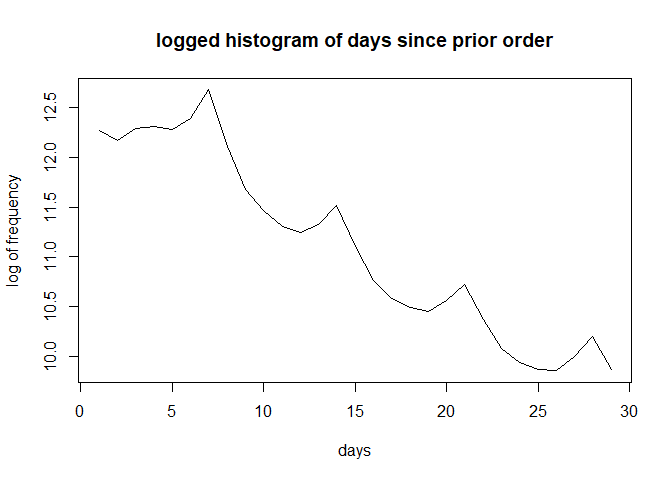
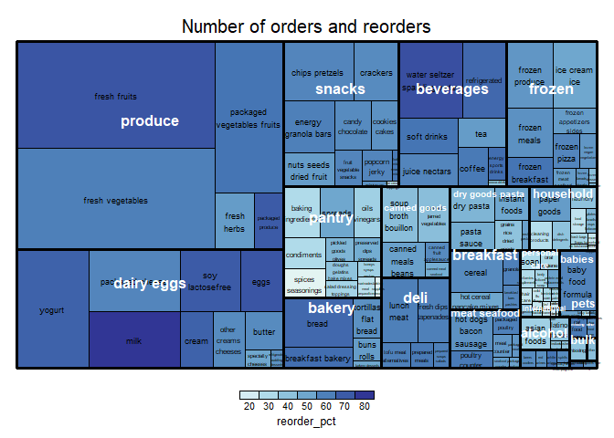

Instacart Analysis
================
Jerry Chiu
February 7, 2021

## Abstract

The main objective of this project is the mining of relevant association rules for use in hypothetical online recommenders. This is not just a simple mining of all association rules; this project will take into account the flexibility, the usefullness, and the importance of the association rules mined to provide new perspectives in designing recommenders.

The analysis takes the following steps:

1.  Data understanding and data integrity check
2.  Data cleaning, data exploration, and statistical analysis
3.  Clustering of products
4.  Mining of association rules
5.  Exploration of the association rules

## 1. Data Understanding and integrity check

The data comes from [Instacart](https://tech.instacart.com/3-million-instacart-orders-open-sourced-d40d29ead6f2), an online shopping platform. The datasets used in this project are:

-   aisles.csv
-   departments.csv
-   products.csv
-   orders.csv
-   order\_products\_\_prior.csv

``` r
aisles=read.csv('aisles.csv')
departments=read.csv('departments.csv')
products=read.csv('products.csv')
orders=read.csv('orders.csv')
order_pp=read.csv('order_products__prior.csv')

# see if any cell is just white space
white.space=function(data){
  return(sum(grepl('^[ ]*$',data)))}

# aisles.csv
colSums(is.na(aisles))
```

    ## aisle_id    aisle 
    ##        0        0

``` r
sapply(aisles, white.space)
```

    ## aisle_id    aisle 
    ##        0        0

``` r
# departments
colSums(is.na(departments))
```

    ## department_id    department 
    ##             0             0

``` r
sapply(departments, white.space)
```

    ## department_id    department 
    ##             0             0

``` r
# orders
colSums(is.na(orders)) #206209, all from days_since_prior_order
```

    ##               order_id                user_id               eval_set 
    ##                      0                      0                      0 
    ##           order_number              order_dow      order_hour_of_day 
    ##                      0                      0                      0 
    ## days_since_prior_order 
    ##                 206209

``` r
sapply(orders, white.space)
```

    ##               order_id                user_id               eval_set 
    ##                      0                      0                      0 
    ##           order_number              order_dow      order_hour_of_day 
    ##                      0                      0                      0 
    ## days_since_prior_order 
    ##                      0

``` r
# products
colSums(is.na(products))
```

    ##    product_id  product_name      aisle_id department_id 
    ##             0             0             0             0

``` r
sapply(products, white.space)
```

    ##    product_id  product_name      aisle_id department_id 
    ##             0             0             0             0

``` r
# order_pp
colSums(is.na(products))
```

    ##    product_id  product_name      aisle_id department_id 
    ##             0             0             0             0

we see that there are no white space or NA's except for the 206209 NA's in orders.csv, let's see why.

``` r
head(orders[which(is.na(orders$days_since_prior_order)),])
```

    ##    order_id user_id eval_set order_number order_dow order_hour_of_day
    ## 1   2539329       1    prior            1         2                 8
    ## 12  2168274       2    prior            1         2                11
    ## 27  1374495       3    prior            1         1                14
    ## 40  3343014       4    prior            1         6                11
    ## 46  2717275       5    prior            1         3                12
    ## 51  2086598       6    prior            1         5                18
    ##    days_since_prior_order
    ## 1                      NA
    ## 12                     NA
    ## 27                     NA
    ## 40                     NA
    ## 46                     NA
    ## 51                     NA

we see that the order\_id is quite random, but the user\_id goes up and is in order, and order\_number is always 1. let's guess that the relationship is that days\_since\_prior\_order is NA exactly when order\_number is 1

``` r
nrow(filter(orders, is.na(days_since_prior_order), order_number!=1))
```

    ## [1] 0

we get nothing such that order number is not 1 and days\_since\_prior\_order is NA, confirming the conjecture

Now the data integrity is checked, we can go onto understand and explore it.

products=read.csv('products\_clean.csv') products.clust=read.csv('products\_clust.csv') clusters=read.csv('cluster.csv') aisle.dep=read.csv('aisle\_dep.csv') order\_size=read.csv('order\_size.csv')

# aisles.csv

``` r
str(aisles)
```

    ## 'data.frame':    134 obs. of  2 variables:
    ##  $ aisle_id: int  1 2 3 4 5 6 7 8 9 10 ...
    ##  $ aisle   : chr  "prepared soups salads" "specialty cheeses" "energy granola bars" "instant foods" ...

``` r
head(aisles)
```

    ##   aisle_id                      aisle
    ## 1        1      prepared soups salads
    ## 2        2          specialty cheeses
    ## 3        3        energy granola bars
    ## 4        4              instant foods
    ## 5        5 marinades meat preparation
    ## 6        6                      other

aisles.csv contains the aisle ID and aisle name that the products are sorted into. Total of 134 aisles. Aisle 6 looks peculiar as it is labeled "other", and aisles 100 is named "missing". Otherwise, nothing interesting yet.

# departments.csv

``` r
str(departments)
```

    ## 'data.frame':    21 obs. of  2 variables:
    ##  $ department_id: int  1 2 3 4 5 6 7 8 9 10 ...
    ##  $ department   : chr  "frozen" "other" "bakery" "produce" ...

``` r
head(departments)
```

    ##   department_id    department
    ## 1             1        frozen
    ## 2             2         other
    ## 3             3        bakery
    ## 4             4       produce
    ## 5             5       alcohol
    ## 6             6 international

departments.csv contains the department ID and department name that the products are sorted into. Total of 21 departments. Department 2 looks peculiar as it is labeled "other", and department 21 is named "missing". Otherwise, nothing interesting yet.

# orders

``` r
str(orders) 
```

    ## 'data.frame':    3421083 obs. of  7 variables:
    ##  $ order_id              : int  2539329 2398795 473747 2254736 431534 3367565 550135 3108588 2295261 2550362 ...
    ##  $ user_id               : int  1 1 1 1 1 1 1 1 1 1 ...
    ##  $ eval_set              : chr  "prior" "prior" "prior" "prior" ...
    ##  $ order_number          : int  1 2 3 4 5 6 7 8 9 10 ...
    ##  $ order_dow             : int  2 3 3 4 4 2 1 1 1 4 ...
    ##  $ order_hour_of_day     : int  8 7 12 7 15 7 9 14 16 8 ...
    ##  $ days_since_prior_order: num  NA 15 21 29 28 19 20 14 0 30 ...

orders.csv contains the order inormation of each user. It contains the user id off each customer, the order id or each order, the day and hour the order is placed, the order number of each user (chronologically), and the gep between two off the user's consecutive orders (days since prior order). Let's look at some stats starting with the number of orders each user has placed.

``` r
test=orders%>%group_by(user_id)%>%summarise(max=max(order_number))
summary(test$max)
```

    ##    Min. 1st Qu.  Median    Mean 3rd Qu.    Max. 
    ##    4.00    6.00   10.00   16.59   20.00  100.00

``` r
hist(test$max, main='Histogram of number of orders per user', xlab='days')
```


Looks like a small outlier of supershoppers with 100 orders... next, we examine the days of the week the orders are placed.

``` r
hist(orders$order_dow, main='Histogram of orders per day of week', xlab='day of week')
```


Looks like day of week 0 and 1 are the most popular. Does the avg user order on a particular dow?

``` r
test1=orders%>%group_by(user_id, order_dow)%>%summarise(n=n())
test=test1%>%group_by(user_id)%>%summarize(max=1/max(n/sum(n)))
summary(test$max)
```

    ##    Min. 1st Qu.  Median    Mean 3rd Qu.    Max. 
    ##   1.000   2.000   2.800   2.923   3.609   7.000

``` r
hist(test$max, main='Histogram of how many days a week users submit orders', xlab='number of days')
```


The result is such that the avg user shops about 3 main days of the week, reasonably spread. Now let's look at the hour of order, same processes.

``` r
summary(orders$order_hour_of_day) # 0 to 23
```

    ##    Min. 1st Qu.  Median    Mean 3rd Qu.    Max. 
    ##    0.00   10.00   13.00   13.45   16.00   23.00

``` r
hist(orders$order_hour_of_day, main='Histogram of orders per hour of day', xlab='hour of day')
```


The peak shopping time is about 10 to 15 o'clock. Do ppl have a tendency to order at certain time of day?

``` r
test=orders%>%group_by(user_id)%>%summarise(mean=mean(order_hour_of_day), sd=sd(order_hour_of_day))
summary(test$mean) #mean of 13.59. about 1 oclock
```

    ##    Min. 1st Qu.  Median    Mean 3rd Qu.    Max. 
    ##    0.75   12.25   13.57   13.59   14.90   23.00

``` r
hist(test$mean, main='Histogram of summarized mean of order hour per user', xlab='hour of day')
```


The average standard deviation is 3.5 hours, meaning on average, the users usually orders within 3.5 hours of their previous orders, somewhat consistent. Now the heatmap.

``` r
orders.heat=orders%>%group_by(order_dow, order_hour_of_day)%>%summarise(n=n())

ggplot(data=orders.heat)+
  geom_tile(aes(x=order_dow,y=order_hour_of_day, fill=n))+
  scale_fill_gradient(high='red', low='green')+
  labs(title="heatmap of orders of a week", x='day of week', y='hour of day')
```


Let's see about day since prior order.

``` r
summary(orders$days_since_prior_order, na.rm=T) 
```

    ##    Min. 1st Qu.  Median    Mean 3rd Qu.    Max.    NA's 
    ##    0.00    4.00    7.00   11.11   15.00   30.00  206209

``` r
hist(orders$days_since_prior_order, main='Histogram of days since prior order', xlab='days')
```


``` r
median(filter(orders, days_since_prior_order!=30)$days_since_prior_order, na.rm=T)
```

    ## [1] 7

Looks like there is a spike at 30 days, this is the cap of the data. The median is 7 days since prior order. Do ppl have a tendency to order in certain day intervals? I think a log graph of the frequency of the histogram would help.

``` r
no30=filter(orders, days_since_prior_order!=30 & !is.na(days_since_prior_order)) #removing 30 days since it is a hard cap
test=hist(no30$days_since_prior_order, plot=F)
plot(x=1:29, y=log(test$counts), type='line', main='logged histogram of days since prior order', xlab='days', ylab='log of frequency')
```



``` r
rm(no30)
```

Looks quite nice with the peaks at multiples of 7, and the decay after is quite predictable In orders, we learned that users usually have 2 to 3 days of the week that they place orders on, and the time of day they do so is within 3.5 hours of each other. We also learned that there is clear signs of weekly ordering (orders of 7, 14, 21, 28 days apart).

# products

``` r
str(products)
```

    ## 'data.frame':    49688 obs. of  4 variables:
    ##  $ product_id   : int  1 2 3 4 5 6 7 8 9 10 ...
    ##  $ product_name : chr  "Chocolate Sandwich Cookies" "All-Seasons Salt" "Robust Golden Unsweetened Oolong Tea" "Smart Ones Classic Favorites Mini Rigatoni With Vodka Cream Sauce" ...
    ##  $ aisle_id     : int  61 104 94 38 5 11 98 116 120 115 ...
    ##  $ department_id: int  19 13 7 1 13 11 7 1 16 7 ...

products.csv contains the product id, name, the aisle the product belongs to, and the department. The first interest here is the relationship between aisle and department. Each aisle belongs to only 1 department. Let's see the relationship. aisle.dep=unique(products\[c('aisle\_id','department\_id')\])

``` r
test=products%>%group_by(department_id, aisle_id)%>%summarise(n=n())
test$department_id=departments[test$department_id,'department']
test$aisle_id=aisles[test$aisle_id,'aisle']
treemap(test, index=c('department_id', 'aisle_id'), vSize='n', title='Departments and Aisles', overlap.labels = 1, fontsize.title = 24, fontsize.labels=c(15, 10), ymod.labels=c(0.3,0))
```


Now, let's see about the product names, cleaning it, to prepare it for clustering. We do this by comparing the most common adjectives shared among the different aisles.

``` r
unique.words=function(data){
  temp=data$product_name
  temp=Boost_tokenizer(temp)
  temp=unique(temp)
  
  return(data.frame(temp))}

mystop=stopwords::stopwords(language='en')
products=inner_join(products, aisles)
products=inner_join(products, departments)
product.names=products
product.names$product_name=gsub('[^A-z]', ' ', product.names$product_name)
product.names$product_name=removePunctuation(product.names$product_name)
product.names$product_name=lemmatize_strings(product.names$product_name)
product.names$product_name=gsub('[^A-z]', ' ', product.names$product_name)
product.names$product_name=gsub(" *\\b[[:alpha:]]{1}\\b *", " ", product.names$product_name)
product.names$product_name=trimws(product.names$product_name)
product.names$product_name=gsub(' +',' ',product.names$product_name)
product.names$product_name=tolower(product.names$product_name)
product.names$product_name=removeWords(product.names$product_name, mystop)
aisle.product.names=product.names%>%group_by(aisle)%>%group_modify(~unique.words(.x))
# now we have all the unique words of every aisle, we can tally
aisle.token.table=table(aisle.product.names$temp)
aisle.token.table=aisle.token.table/max(aisle.token.table)
aisle.token.table=aisle.token.table[order(aisle.token.table, decreasing=T)]
#we only want to filter out the non-nouns
# we use NLP tagging to find all the non-nouns in the descriptor 
top=data.frame(word=tolower(names(aisle.token.table)), freq=as.vector(aisle.token.table))

annotate.word=function(word){
  temp=annotate(word, list(Maxent_Sent_Token_Annotator(), Maxent_Word_Token_Annotator()))
  temp=annotate(word, Maxent_POS_Tag_Annotator(), temp)
  temp=subset(temp, type=='word')
  tags=sapply(temp$features, '[[', 'POS')
  return(tags)
}

tags=annotate.word(top$word)
top=cbind(top, tags)
top=top[order(top$freq, decreasing=T),]
# since the NLP tags are not perfect (orange got tagged as adj but we do have some oranges in produce), we manually filter

top[which(top$word%in%c('pack', 'style', 'flavor', 'mix','light','blend','size','ct','mini','oz')),'tags']='JJ'
top[which(top$word%in%c('orange','almond','french','olive')),'tags']='NN'

topJJ=subset(top, !tags%in%c('NN','DT','TO'))
topJJ=topJJ[1:50,]

aisle.token.table=subset(aisle.token.table, names(aisle.token.table)%in%topJJ$word)
par(bg="black")
wordcloud(words=topJJ$word, freq=topJJ$freq, scale=c(4,-1), rot.per=F, random.order=F, use.r.layout=T, colors=brewer.pal(8,"Accent"), random.color=F) #top words
```


we see that free, natural, organic, original are the our biggest common words between all the aisles. We can filter them out along with some others when we get to the analysis part.Now let's have a look of what things are in each department.

``` r
count.ngrams=function(data, n, nword='all'){
  temp=data$product_name
  temp=removeWords(temp, topJJ$word)
  temp=gsub(" *\\b[[:alpha:]]{1}\\b *", " ", temp)
  temp=trimws(temp)
  temp=gsub(' +', ' ',temp)
  temp=temp[which(sapply(strsplit(temp, " "), length)>=n)]
  temp=ngram(temp, n=n)
  temp=get.phrasetable(temp)
  if(is.numeric(nword)){
    temp=temp[1:nword,]}
  return(temp)}

ngram.treemap=function(data, n, nword){
  ngram.dep=data%>%group_by(department_id)%>%group_modify(~count.ngrams(.x, n=n, nword=nword))
  ngram.dep$department_id=str_to_title(departments[ngram.dep$department_id,'department'])
  ngram.dep$size=1
  treemap(ngram.dep, index=c('department_id', 'ngrams'), algorithm='pivotSize', vSize='size', title=paste0('Top ', nword,' Frequent ', n, '-grams of each Department'), overlap.labels = 1, 
          fontsize.title = 20, fontsize.labels=c(15, 7), bg.labels=0, fontcolor.labels=c('white','black'), force.print.labels=T, ymod.labels=c(0.3,0))
  }

for(i in c(1,2)){ngram.treemap(product.names, i, 10)}
```


We clearly see that the aisle and department named "missing" has products that have names with ice cream, dark chocolate, etc. We should be able to sort them into the other aisles.

if we know aisle, we know its department already, so really, gotta put them into correct aisle. We do this by matching ngrams of the product to the ngrams in each aisle then choosing the aisle with the most matches as the aisle. We do a test on the non-missing product first to see the accuracy of this method, then we can do it on the missing aisle.

``` r
product.names$product_name=removeWords(product.names$product_name, topJJ$word)
product.names$product_name=gsub(" *\\b[[:alpha:]]{1}\\b *", " ", product.names$product_name)
product.names$product_name=trimws(product.names$product_name)
product.names$product_name=gsub(' +', ' ',product.names$product_name)

get.aisle.phrases=function(data){
  phrase=data.frame()
  for(n in 1:3){
    temp=data$product_name
    temp=temp[which(sapply(strsplit(temp, " "), length)>=n)]
    temp=ngram(temp, n=n)
    temp=get.phrasetable(temp)
    temp$ngrams=trimws(temp$ngrams)
    temp$phrase.length=n
    phrase=rbind(phrase, temp)}
  
  return(phrase)}

predict.aisle=function(data){
  pname=data$product_name
  nword=sapply(strsplit(pname, " "), length)
  if(nword){}
  match.found=F
  while(!match.found & nword>0){
    temp=ngram(pname, n=nword)
    temp=get.ngrams(temp)
    candidates=aisle.phrases[which(aisle.phrases$phrase.length==nword),]
    candidates=filter(candidates, ngrams%in%temp)
    match.found=ifelse(nrow(candidates)==0, F, T)
    if(match.found){
      pred=candidates%>%group_by(aisle_id)%>%summarise(score=sum(freq))
      pred=pred[order(pred$score, decreasing=T)[1],'aisle_id']
    }else{
      nword=nword-1}
  }
  if(!exists('pred')){return(100)}else{return(pred)}
}

aisle.phrases=filter(product.names, aisle!='missing')%>%group_by(aisle_id)%>%group_modify(~get.aisle.phrases(.x))
test=product.names[sample(nrow(product.names),size=3000),]

for(i in 1:nrow(test)){
  test[i,'pred']=predict.aisle(test[i,])
}

length(which(test$pred==test$aisle_id))/3000
```

    ## [1] 0.899

The accuracy of this method/model is around 90% with non-missing aisles, it's pretty good. We now go to put the products in the missing aisle into the other aisles.

``` r
missing.aisle=filter(product.names, aisle=='missing')
for(i in 1:nrow(missing.aisle)){
  missing.aisle[i,'aisle_id']=predict.aisle(missing.aisle[i,])
  }

aisle.dep=unique(products[c('aisle_id','aisle','department_id','department')])
aisle.dep=aisle.dep[order(aisle.dep$aisle_id),]
missing.aisle[c('aisle','department_id','department')]=
  aisle.dep[missing.aisle$aisle_id, c('aisle','department_id','department')]
test=product.names
product.names[which(product.names$aisle=='missing'),]=missing.aisle
```

# orders\_products\_prior

``` r
str(order_pp)
```

    ## 'data.frame':    32434489 obs. of  4 variables:
    ##  $ order_id         : int  2 2 2 2 2 2 2 2 2 3 ...
    ##  $ product_id       : int  33120 28985 9327 45918 30035 17794 40141 1819 43668 33754 ...
    ##  $ add_to_cart_order: int  1 2 3 4 5 6 7 8 9 1 ...
    ##  $ reordered        : int  1 1 0 1 0 1 1 1 0 1 ...

order\_products\_prior is the item-by-item list of each order. It includes the order id, the product id, if the product is a reorder from last order, and the order which the item is added to the cart.

``` r
order_size=order_pp%>%group_by(order_id)%>%summarise(n=max(add_to_cart_order))
summary(order_size$n)
```

    ##    Min. 1st Qu.  Median    Mean 3rd Qu.    Max. 
    ##    1.00    5.00    8.00   10.09   14.00  145.00

``` r
sd(order_size$n)
```

    ## [1] 7.525398

``` r
outlier.range=function(data, mult=1.5){
  low=quantile(data, 0.25, na.rm=T)
  high=quantile(data, 0.75, na.rm=T)
  iqr=IQR(data, na.rm=T)
  temp=c(low-mult*iqr, high+mult*iqr)
  return(as.vector(temp))}

order_size=order_size[which(order_size$n%between%outlier.range(order_size$n, 2)),]
order_size=inner_join(orders[c('order_id','user_id')],order_size)
order_size=order_size%>%group_by(n)%>%summarise(num.order=n(), num.user=length(unique(user_id)))


ggplot()+
  geom_bar(data=order_size, stat='identity', aes(x=n, y=num.order, fill=num.user))+
  labs(title='Number of orders per order size', x='Order Size', y='Number of Orders')+
  scale_fill_gradient(name = "Number of Users", low='#0027fc', high='#f71b1b')
```


``` r
order_pp=inner_join(order_pp, products, by='product_id')
order_size=order_pp%>%group_by(department, aisle)%>%summarise(n=n(), reordered=sum(reordered), reorder_pct=reordered/n*100)
treemap(order_size, index=c('department', 'aisle'), algorithm='pivotSize', type='value', vSize='n', vColor='reorder_pct', title="Number of orders and reorders", 
        overlap.labels = 1, fontsize.title = 15, fontsize.labels=c(12, 7), bg.labels=0, fontcolor.labels=c('white','black'), 
        fontsize.legend=10, force.print.labels=T, ymod.labels=c(0.3,0), palette='RdYlBu')
```



Let's see the order the products are placed in baskets and how much of the order they constitute.

``` r
basket=order_pp[c('order_id', 'department_id', 'add_to_cart_order', 'reordered')]
basket=basket%>%group_by(department_id)

i=0
basket.order=function(data){
  i<<-i+1
  mean=mean(data$add_to_cart_order)
  temp=data[order(data$order_id, data$add_to_cart_order),]
  temp=data%>%group_by(order_id)%>%summarise(first=first(add_to_cart_order))
  temp=mean(temp$first)
  reordered=sum(data$reordered)
  temp=data.frame(first=temp, mean=mean, total=nrow(data), reordered=reordered)
  return(temp)}

basket=group_modify(basket, ~basket.order(.x))
basket$department=departments[basket$department_id,'department']
basket=filter(basket, department!='missing')
basket$reordered=basket$reordered/basket$total

ggplot(data=basket, aes(x=first, y=total, label=str_to_title(department)))+
  geom_point(size=basket$reordered^2*25, color='red', alpha=0.7)+
  labs(title='Department popularity', x='Mean of first add to cart order', y='Total orders')+
  geom_text_repel(box.padding=0.2)
```


The above shows the department popularity, as measured in the order at which they are placed in the cart, and their re-order rate (circle size). Looks like produce and dairy are usually the first items customers go to for reorders. Now lets see the relationship between days since prior order and the basket size.

``` r
order_size=table(order_pp$order_id)
order_size=data.frame(order_id=names(order_size), size=as.vector(order_size))
order_size$order_id=as.numeric(order_size$order_id)
# now we can actually go back to orders and find out the relationship between days_since_prior_order and order size
orders=inner_join(orders, order_size, by='order_id')
summary(order_size$size)
```

    ##    Min. 1st Qu.  Median    Mean 3rd Qu.    Max. 
    ##    1.00    5.00    8.00   10.09   14.00  145.00

``` r
orders.plot=filter(orders, size %between% outlier.range(size, 2), 
                   days_since_prior_order<30, !is.na(days_since_prior_order))
orders.plot=orders.plot%>%group_by(size, days_since_prior_order)%>%summarise(n=n())
ggplot(data=orders.plot)+
  geom_tile(aes(x=size, y=days_since_prior_order, fill=n))+
  scale_fill_gradient(name='number of orders', low='darkblue', high='orange')+
  scale_x_continuous(breaks=seq(0, max(orders.plot$size), 1), labels=seq(0, max(orders.plot$size), 1))+
  scale_y_continuous(breaks=seq(0,30,1), labels=seq(0,30,1))+
  theme(text = element_text(size=10), legend.key.size = unit(10, 'mm'))+
  labs(title='size of orders vs days since prior order',x='size of order',y='days since prior order')
```


There seems to be no apparent relationship between the basket size and days since prior order.

## 3. Clustering of products

first order of business is to cluster the products so that each aisle is split into many clusters of similar products. We would do this with the cleaned product names and using ngrams.

``` r
aisle.dep=products%>%group_by(department, aisle)%>%summarise(n=n())
fast.cos.dist=function(data){
  dim.data=nrow(data)
  mat=as.matrix(data)
  xy=mat%*%t(mat)
  diag=sqrt(diag(xy))
  diag[which(diag==0)]=1
  x2mat=matrix(data=diag, ncol=dim.data, nrow=dim.data)
  y2mat=t(x2mat)
  dist=xy/(x2mat*y2mat)
  return(1-round(dist,10))
  }

count.words=function(data, top=5){
  tokens=Boost_tokenizer(data$product_name)
  temp=table(tokens)
  temp=temp[order(temp, decreasing=T)[1:top]]
  temp=data.frame(word=names(temp), freq=as.vector(temp))
  return(temp)
}

cluster.prod=function(data){
  names=VCorpus(VectorSource(data$product_name))
  names=DocumentTermMatrix(names)
  names=as.matrix(names)
  names.dist=as.dist(fast.cos.dist(names))
  
  prod.clust=hclust(names.dist, method='ward.D2')
  clusters=cutree(prod.clust, k=floor(sqrt(nrow(data))))
  data=cbind(data, clusters)
  return(data)
  }

name.cluster=function(data){
  cluster.size=nrow(data)
  data=Boost_tokenizer(data$product_name)
  data=prop.table(table(data))
  data=data[order(data, decreasing=T)[1:3]]
  data=paste(names(data), collapse=' ')
  return(data.frame(cluster.name=data, cluster.size=cluster.size))
}

products.clust=product.names%>%group_by(aisle_id)%>%group_modify(~cluster.prod(.x))
products.clust$clusters=products.clust$clusters+100*products.clust$aisle_id

# cluster names now, extracted from the top words of each aisle
cluster.names=products.clust%>%group_by(aisle_id, clusters)%>%group_modify(~name.cluster(.x))
order_pp=inner_join(order_pp, products.clust[c('product_id','clusters')], by='product_id')
cluster.freq=table(order_pp$clusters)
cluster.freq=data.frame(clusters=names(cluster.freq), freq=as.vector(cluster.freq))
cluster.freq$clusters=as.numeric(cluster.freq$clusters)
cluster.names=inner_join(cluster.freq, cluster.names, by='clusters')
cluster.names$prop=cluster.freq$freq/sum(cluster.freq$freq)
```

## Association rule mining with apriori

Now we have the clustered items, we join it with the orders\_pp so we can apply apriori. But first, we gotta

``` r
transactions=inner_join(order_pp[c('order_id','product_id')], products.clust[c('product_id','clusters')], by='product_id')
transactions=transactions[,-which(names(transactions)=='product_id')]
outlier.products=cluster.names[which(cluster.names$prop>quantile(cluster.names$prop, 0.95)),'clusters']
transactions=filter(transactions, !clusters%in%outlier.products)
transactions=format_csv(transactions)
conn=textConnection(object=transactions)
transactions=read.transactions(conn, 'single', cols=c("order_id","clusters"), header=T, sep = ",")
##transactions=read.transactions('order_transactions.csv', 'single', cols=c("order_id","clusters"), header=T, sep = ",")
supp.min=quantile(cluster.names$prop, 0.3)
rules=apriori(transactions, parameter = list(supp=supp.min ,conf = 0.15, target = "rules"))
```

    ## Apriori
    ## 
    ## Parameter specification:
    ##  confidence minval smax arem  aval originalSupport maxtime     support minlen
    ##        0.15    0.1    1 none FALSE            TRUE       5 4.62224e-05      1
    ##  maxlen target  ext
    ##      10  rules TRUE
    ## 
    ## Algorithmic control:
    ##  filter tree heap memopt load sort verbose
    ##     0.1 TRUE TRUE  FALSE TRUE    2    TRUE
    ## 
    ## Absolute minimum support count: 137 
    ## 
    ## set item appearances ...[0 item(s)] done [0.00s].
    ## set transactions ...[2236 item(s), 2982551 transaction(s)] done [5.37s].
    ## sorting and recoding items ... [2176 item(s)] done [0.20s].
    ## creating transaction tree ... done [3.40s].
    ## checking subsets of size 1 2 3 4 5 6 7 done [4.26s].
    ## writing ... [13947 rule(s)] done [0.03s].
    ## creating S4 object  ... done [0.57s].

``` r
rm(transactions)
rules.frame=DATAFRAME(rules)
rules.frame=rules.frame[order(rules.frame$lift, decreasing=T),]
```

## Exploration of association rules

We now have the rules, let's see what special things can be found.

``` r
rule.cluster.name=function(row){
  row=gsub('[{|}]', '', row)
  row=as.numeric(str_split(row, ',')[[1]])
  row=paste(cluster.names[which(cluster.names$clusters%in%row),'cluster.name'], collapse=', ')
  return(row)
}

rules.frame$LHS.name=sapply(rules.frame$LHS, rule.cluster.name)
rules.frame$RHS.name=sapply(rules.frame$RHS, rule.cluster.name)
head(rules.frame[, c('LHS.name','RHS.name')], 20)
```

    ##                                                                     LHS.name
    ## 5                                                       tasty treasure gravy
    ## 7524                           cat food tuna, beef cat food, food cat salmon
    ## 540                                           cat food tuna, cat food turkey
    ## 543                                             cat food tuna, beef cat food
    ## 742                                           beef cat food, cat food turkey
    ## 7526                          feast cat food, beef cat food, food cat salmon
    ## 22                                                           dal lentil bean
    ## 11665  food baby pear, chicken food stage, stage just apple, baby food stage
    ## 11655  food baby pear, chicken food stage, apple food baby, stage just apple
    ## 542                                          feast cat food, cat food turkey
    ## 11685   food baby pear, chicken food stage, apple food baby, baby food stage
    ## 11660 chicken food stage, apple food baby, stage just apple, baby food stage
    ## 797                                           beef cat food, food cat salmon
    ## 25                                                           cat food savory
    ## 736                                          beef cat food, treat cat salmon
    ## 7582                     food baby pear, chicken food stage, baby food stage
    ## 7554                    food baby pear, chicken food stage, stage just apple
    ## 7574                     food baby pear, chicken food stage, apple food baby
    ## 7525                          feast cat food, cat food tuna, food cat salmon
    ## 550                                           cat food tuna, food cat salmon
    ##                      RHS.name
    ## 5             cat food dinner
    ## 7524           feast cat food
    ## 540            feast cat food
    ## 543            feast cat food
    ## 742            feast cat food
    ## 7526            cat food tuna
    ## 22     indian cuisine spinach
    ## 11665 dinner vegetable turkey
    ## 11655 dinner vegetable turkey
    ## 542             cat food tuna
    ## 11685 dinner vegetable turkey
    ## 11660 dinner vegetable turkey
    ## 797            feast cat food
    ## 25            cat food dinner
    ## 736            feast cat food
    ## 7582  dinner vegetable turkey
    ## 7554  dinner vegetable turkey
    ## 7574  dinner vegetable turkey
    ## 7525            beef cat food
    ## 550            feast cat food

Nice, we see some very high lifts, which means the rules are very significant. We modify the data such that we can graph the relationships between aisles as described by the rules.

``` r
## convert the cluster number into aisles
aisle.rules=function(data, naisle){
  edges=data.frame(matrix(ncol=3, nrow=0))
  colnames(edges)=c('lhs','rhs','count')
  for(i in 1:nrow(data)){
    row=data[i,]
    lhs=gsub('[{|}]', '', row$LHS)
    lhs=as.numeric(str_split(lhs,',')[[1]])
    lhs=lhs%/%100
    rhs=gsub('[{|}]', '', row$RHS)
    rhs=as.numeric(str_split(rhs,',')[[1]])
    rhs=rhs%/%100
    n=row$count
    conn=data.frame(lhs=lhs, rhs=rhs, count=n)
    edges=rbind(edges, conn)
  }
  edges=edges%>%group_by(lhs,rhs)%>%summarise(count=sum(count))
  edges$lhs=aisles[edges$lhs,'aisle']
  edges$rhs=aisles[edges$rhs,'aisle']
  
  aisle=edges%>%group_by(lhs)%>%summarise(n=sum(count))
  aisle=aisle[order(aisle$n, decreasing=T)[1:naisle],]
  
  self.count=edges[which(edges$lhs==edges$rhs),]
  self.count=self.count%>%group_by(lhs)%>%summarise(n=sum(count))
  
  edges=edges[which(edges$lhs!=edges$rhs),]
  edges=edges[order(edges$count, decreasing=T),]
  
  nodes=data.frame(lhs=unique(c(edges$lhs, edges$rhs)))
  nodes=full_join(nodes, self.count, by='lhs')
  
  nodes=nodes[which(nodes$lhs%in%aisle$lhs),]
  edges=edges[which(edges$lhs%in%aisle$lhs & edges$rhs%in%aisle$lhs),]
  return(list(edges, nodes))
}
test=aisle.rules(rules.frame, 20)
edges=test[[1]]
nodes=test[[2]]
g=graph_from_data_frame(d=edges, vertices=nodes, directed=FALSE)
E(g)$width=edges$count/4000
V(g)$size=log(nodes$n)^1.3
par(mar=c(1,1,1,1))
plot.igraph(g, vertex.label.cex = .65, layout=layout_in_circle, edge.curved=.25, main='Association-rule-based relationship between aisles')
```


The above graph shows the most popular association rules by support. The size of the nodes means the support of rules from the aisle to itself. We got some nice connections like hot dogs/buns and canned veg/canned meals. Also beers don't seem to be relateed to anyone but themselves. It also looks like people who buys a lot of baby formula. However, wee see that a lot of the rules are from things within the same aisle such as turkey cat food -&gt; beef cat food. Let's look at some rules that crosses aisles to see if there's anything interesting.

``` r
rule.cross.aisle=function(row){
  rhs=gsub('[{|}]', '', row['RHS'])
  lhs=gsub('[{|}]', '', row['LHS'])
  rhs=as.numeric(str_split(rhs, ',')[[1]])
  lhs=as.numeric(str_split(lhs, ',')[[1]])
  rhs=unique(rhs%/%100)
  lhs=unique(lhs%/%100)
  return(ifelse(length(intersect(lhs,rhs)), F, T))
}

rules.frame$cross.aisle=apply(rules.frame, 1, rule.cross.aisle)
table(rules.frame$cross.aisle)
```

    ## 
    ## FALSE  TRUE 
    ## 13366   581

``` r
cross.aisle=filter(rules.frame, cross.aisle==1)
head(cross.aisle[, c('LHS.name','RHS.name')], 20)
```

    ##                                               LHS.name                 RHS.name
    ## 1                                 margarita lime mixer     tequila silver agave
    ## 2                  cream soup condense, bean green cut       french dress salad
    ## 3      frost chocolate supreme, frost vanilla funfetti     cake chocolate moist
    ## 4                 brain dream power, apple honey juice         mate yerba loose
    ## 5  mate yerba loose, mint tea green, apple honey juice        brain dream power
    ## 6                   vegan wedge chao, fruit roll strip              yog oh chia
    ## 7    smoothie fruit juice, blueberry smoothie lemonade    strawberry juice kiwi
    ## 8              cream soup condense, french dress salad           bean green cut
    ## 9                              frost chocolate supreme     cake chocolate moist
    ## 10                                cake chocolate moist  frost chocolate supreme
    ## 11                                  cream frost cheese     cake chocolate moist
    ## 12                              frost vanilla funfetti     cake chocolate moist
    ## 13                                cake chocolate moist   frost vanilla funfetti
    ## 14                 mate yerba loose, apple honey juice        brain dream power
    ## 15                   mint tea green, apple honey juice        brain dream power
    ## 16 brain dream power, mate yerba loose, mint tea green        apple honey juice
    ## 17                  bean green cut, french dress salad      cream soup condense
    ## 18                       vegan wedge chao, yog oh chia         fruit roll strip
    ## 19            chocolate bar milk, cracker graham honey marshmallow vanilla puff
    ## 20        marshmallow vanilla puff, chocolate bar milk     cracker graham honey

Some interesting cross-aisle rules found by just scanning:

``` r
cross.aisle[c(49, 43, 57, 12, 380, 58),c('LHS.name','RHS.name','lift')]
```

    ##                                           LHS.name                RHS.name
    ## 49       marinara sauce spicy, ricotta cheese skim     lasagna wheat pasta
    ## 43  marshmallow vanilla puff, cracker graham honey      chocolate bar milk
    ## 57         pizza sauce authentic, part skim cheese  pepperoni slice turkey
    ## 12                          frost vanilla funfetti    cake chocolate moist
    ## 380        popcorn gourmet peanut, nut pine hummus         chip pita naked
    ## 58                                 gin spin london tonic water elderflower
    ##          lift
    ## 49   90.96881
    ## 43   95.83803
    ## 57   86.97493
    ## 12  231.04207
    ## 380  17.61800
    ## 58   86.21966

Looks like we got some lasagna, s'mores, pizza, vanilla chocolate cake, movie snacks with popcorn and chips, and gin and tonic. Those are just a few of the variety we have in the cross-aisle rules. This concludes the in-depth analysis.

``` r
#write.csv(rules.frame ,'arules_all_s03_c015.csv')
#write.csv(cross.aisle ,'arules_cross_s03_c015.csv')
```

For all the association rules, go to arules_all_s03_c015.csv
For all the cross-aisle association rules, go to arules_cross_s03_c015.csv